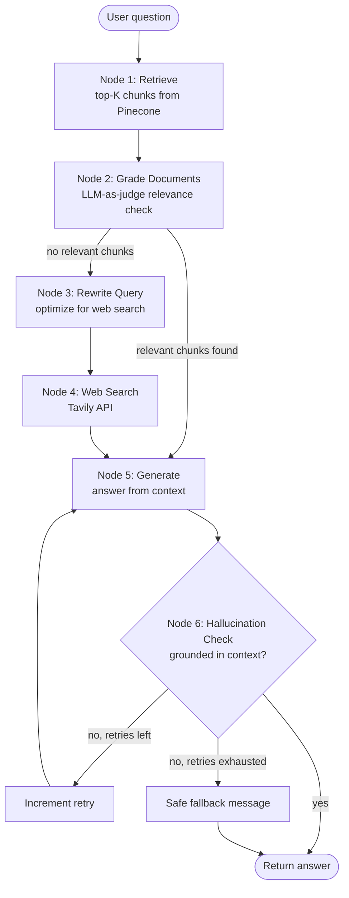

# 💹 CRAG-Ops: Cloud-Native Agentic RAG for Financial Intelligence

A self-correcting, agentic RAG system for analyzing SEC 10-K filings. Built with
**LangGraph**, **Pinecone (Serverless)**, **OpenAI**, and **Tavily**, deployed via
**Streamlit**.

Unlike a standard "retrieve-then-generate" RAG pipeline, this agent grades its
own retrievals, rewrites its query and falls back to live web search when the
knowledge base can't answer, and checks its own final answer for hallucination
before it's shown to the user.

---

## 1. Architecture



**Ingestion runs on a separate, idempotent path** (`ingest.py`), triggered either
by the CLI (`python ingest.py`) or by the Streamlit sidebar uploader. Every
document is hashed; Pinecone is checked for that hash before any embedding call
is made, so re-running ingestion or restarting the app never re-embeds existing
documents.

### Project structure

```
crag-ops/
├── config.py          # env vars + shared Pinecone/OpenAI client factories
├── ingest.py           # dynamic, deduplicated ingestion pipeline
├── agent.py             # LangGraph CRAG state machine
├── app.py                # Streamlit chat UI + sidebar uploader
├── requirements.txt
├── .env.example
├── data/                 # put your source 10-K PDFs here (for bulk ingest)
└── README.md
```

---

## 2. Task 1 — Sourcing sample 10-K PDFs from SEC EDGAR

You need real 10-K filings to test the system. SEC EDGAR is free, requires no
account, and serves clean PDFs. Steps (repeat per company):

1. Go to **https://www.sec.gov/cgi-bin/browse-edgar?action=getcompany**
2. Enter the company name or ticker in "Company name" (e.g. `Apple Inc`,
   `Microsoft Corp`, `NVIDIA Corp`) and click **Search**.
3. In the results table, find the **most recent filing with type `10-K`**
   (use the "Filing Type" search box on the company's filing page and type
   `10-K` to filter).
4. Click the filing's **Documents** link. This opens the filing index page.
5. In the document list, click the primary filing document — it's usually
   named something like `aapl-20240928.htm` (the main 10-K, not an exhibit).
6. This opens the filing as an HTML page in your browser. Use your browser's
   **Print → Save as PDF** function to export it, or use the SEC's own
   generated PDF link if one is listed on the index page (`.pdf` next to the
   document).
7. Save the file into this project's `data/` folder, e.g.:
   ```
   data/apple_10k_2024.pdf
   data/microsoft_10k_2024.pdf
   data/nvidia_10k_2024.pdf
   ```

Direct company search shortcuts (paste ticker into the CIK lookup box at
`https://www.sec.gov/cgi-bin/browse-edgar?action=getcompany&company=<name>`):
Apple → `AAPL`, Microsoft → `MSFT`, NVIDIA → `NVDA`.

> SEC EDGAR's fair-access policy asks automated tools to identify themselves
> and rate-limit requests — for this manual, browser-based download of a
> handful of filings you don't need to do anything special, but avoid
> scripting bulk downloads without a declared User-Agent header.

---

## 3. Setup

```bash
# 1. Clone / open this project, then create a virtual environment
python -m venv venv
source venv/bin/activate        # Windows: venv\Scripts\activate

# 2. Install dependencies
pip install -r requirements.txt

# 3. Configure secrets
cp .env.example .env
# then edit .env and fill in OPENAI_API_KEY, PINECONE_API_KEY, TAVILY_API_KEY

# 4. Add your 10-K PDFs (see Task 1 above) into ./data/

# 5. Bulk-ingest the initial corpus (one-time; safe to re-run)
python ingest.py

# 6. Launch the app
streamlit run app.py
```

Once running, use the chat box to ask things like:
- *"What was Apple's total net sales in the most recent fiscal year?"*
- *"Summarize NVIDIA's key risk factors related to supply chain."*
- *"What was Microsoft's R&D spend as a percentage of revenue?"*

To add a new filing later, use the **sidebar uploader** in the running app —
no restart required, and the new document is queryable on your next question.

---

## 4. Environment variables

| Variable | Purpose | Where to get it |
|---|---|---|
| `OPENAI_API_KEY` | Powers `gpt-4o-mini` for grading, rewriting, and generation (embeddings are now local/offline -- see below, so this key is NOT billed for embedding calls) | https://platform.openai.com/api-keys |
| `PINECONE_API_KEY` | Auth for your cloud vector database | https://app.pinecone.io (API Keys section) |
| `PINECONE_INDEX_NAME` | Name of the Serverless index (auto-created on first run if missing) | any string, defaults to `crag-ops-10k-hf` |
| `PINECONE_CLOUD` / `PINECONE_REGION` | Serverless index location | defaults to `aws` / `us-east-1`; must match a region Pinecone Serverless supports on your plan |
| `TAVILY_API_KEY` | Live web search fallback when the vector DB has no relevant chunks | https://tavily.com |

**Embeddings note:** this project embeds text locally using
`sentence-transformers/all-MiniLM-L6-v2` (384 dimensions) via
`langchain-huggingface` -- no API key needed, no per-embedding cost, works
offline after the model's first download. The Pinecone index dimension
(384) must match this model; if you ever change embedding models, you must
also point `PINECONE_INDEX_NAME` at a fresh index of the new dimension
(Pinecone indexes are locked to one dimension for their lifetime).

---

## 5. Deploying to Streamlit Community Cloud

1. Push this project to a GitHub repo (commit `.env.example`, **not** `.env`).
2. Go to https://share.streamlit.io → **New app** → point it at your repo,
   branch, and `app.py`.
3. Before/after deploying, open **App settings → Secrets** and paste your
   keys in TOML form:
   ```toml
   OPENAI_API_KEY = "sk-..."
   PINECONE_API_KEY = "pcsk_..."
   PINECONE_INDEX_NAME = "crag-ops-10k-hf"
   PINECONE_CLOUD = "aws"
   PINECONE_REGION = "us-east-1"
   TAVILY_API_KEY = "tvly-..."
   ```
4. Commit `packages.txt` (already included) -- Streamlit Cloud reads it and
   `apt-get install`s `tesseract-ocr`, which the OCR fallback extraction
   tier needs. Without it, everything else still works; only the last-resort
   OCR tier for genuinely scanned PDFs would be unavailable.
5. Deploy. Because vectors live in Pinecone (not on Streamlit's ephemeral
   filesystem), the app can be redeployed, restarted, or even rebuilt from
   scratch at any time without losing the knowledge base or re-embedding
   anything. Note the local embedding model (~90MB) re-downloads on a fresh
   container's first request -- this is a one-time cold-start cost, not a bug.
6. Bulk-ingest your initial `/data` corpus **once**, from your local machine
   (`python ingest.py`) before or after the first deploy — both work, since
   ingestion just talks to the same Pinecone index the deployed app uses.

---

## 6. Completely changing the knowledge base

To wipe every currently-indexed PDF and start fresh with a new set:

```bash
python ingest.py --reset
```

This prompts you to type `RESET` to confirm (destructive, cannot be undone),
then deletes every vector from the Pinecone index and immediately re-runs
bulk ingestion on whatever is currently in `/data`. To skip the prompt in a
script: `python ingest.py --reset --yes`.

You can also do this from the running app: sidebar → **⚠️ Danger zone:
reset knowledge base** → type `RESET` → **Delete all indexed documents**.
After resetting via the UI, upload your new PDFs through the sidebar as usual.

Either path only clears vectors -- it does **not** delete or recreate the
Pinecone index itself, so there's no dimension/region reconfiguration to
worry about afterward.

---

## 7. Design notes / constraint checklist

- ✅ **Vector embeddings live only in Pinecone.** No FAISS/Chroma files, no
  local pickle stores. `config.get_vectorstore()` is the only place vectors
  are read or written, and it always points at the cloud index. This holds
  regardless of which embedding model produces the vectors -- local
  Sentence Transformer embeddings land in Pinecone exactly the same way
  OpenAI embeddings would.
- ✅ **No re-embedding on restart.** `ingest.document_already_ingested()`
  checks Pinecone itself (via a deterministic-ID `fetch()`) before any
  embedding call — the check is against the cloud DB, not a local cache, so
  it's correct even across container restarts, redeploys, or a different
  machine entirely running `ingest.py`. This check is independent of the
  embedding provider.
- ✅ **Dynamic ingestion via the UI.** The Streamlit sidebar uploader calls
  the exact same `ingest_file()` function as the CLI bulk loader, so a newly
  uploaded PDF is embedded and queryable within the same session — no app
  restart, no manual re-indexing step.
- ✅ **Robust PDF text extraction.** A four-tier cascade (pypdf → PyMuPDF →
  pypdfium2 → OCR) handles everything from clean text-native PDFs to ones
  with broken font encodings to genuine scanned images, without ever
  silently reporting false success. See `ingest.py`'s module docstring for
  details on why each tier exists.
- ✅ **Corrective RAG (CRAG) principles implemented in LangGraph:** document
  relevance grading, conditional query rewriting, web-search fallback, and a
  hallucination-grounding check with a bounded self-correction loop before
  falling back to an honest "I don't know" rather than a fabricated answer.
